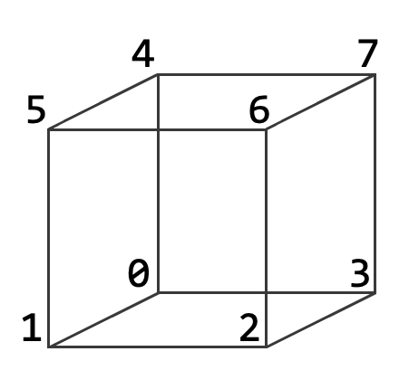

## How to map a tetmesh on a custom simple domain

[This tool](./) implements the graph embedding strategy described in Section 5 in the paper. 
The tool can also be used to map on simple custom domains not included in VOLMAP. To do so, users can provide an input file describing the abstract graph and its embedding. 
In this case, the syntax to call the command is: 

```
./surface_mapping_check CUSTOM <filename.mesh> <srf_mapping.txt> <custom_domain.txt>
```

[This file](./custom_triprism_domain.txt) shows an example of how to encode a custom domain for our tool (a triangular prism, in this case). In the file you need to encode 3 information:

- the nodes of the graph (vertices of the domain)
- the arcs of the graph (segments of the domain)
- the positions (coordinates) in which map the input surface vertices associated to the domain's node.

The graph nodes are encoded as corners (or combination of) the input model's bounding box, preceded by the letter "n", considering the following corner enumeration:  



Examples: 

```
// a node corresponding to the corner 0 of the bounding box
n 0 
```

```
// a node corresponding to the midpoint of the edge 1-5 of the bounding box
n 1 5 
```

```
// a node corresponding to the centroid of the face 4-5-6-7 of the bounfding box
n 4 5 6 7
```

The position in which map each domain corner is encoded with a line that starts with "nm" and follows with the x, y, and z coordinates. Note that the file must contain the same number of lines starting with "n" and "nm". Example: 

```
// a node corresponding to the midpoint of the edge 4-5 of the bounding box to map into a point p(1.0, 7.5, 12.3)
n 4 5
nm 1.0 7.5 12.3
```

Lastly, each graph arc is encoded in the file with a line starting with "a" followed by the indices of the 2 segment endpoints. Example: 

```
a 0 1
a 1 2
...
```
:warning: WARNING: The tool assumes that the connectivity encoded in the file is correct, with only planar and convex faces. No checks are made about that. 

